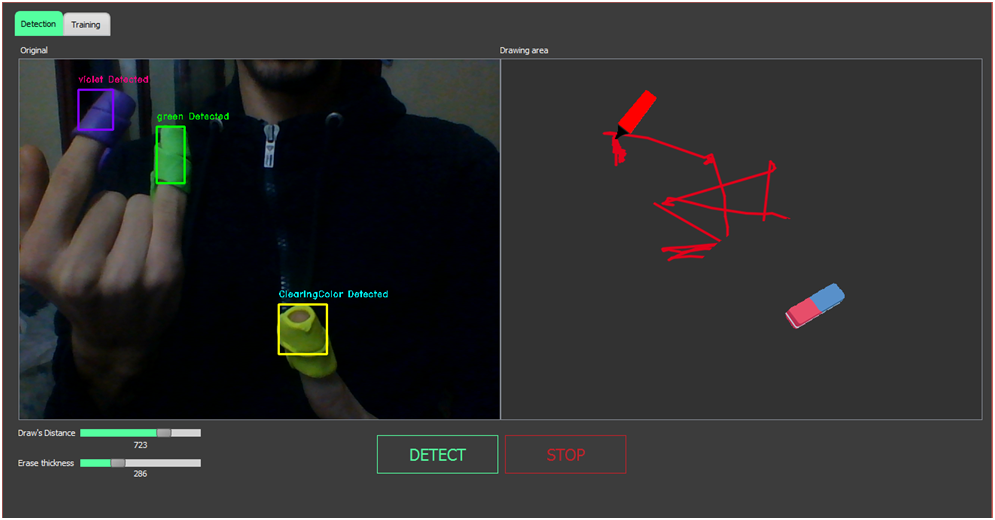

# Description
  Utility for detecting colored object with the ability of drawing for a fixed distance, it's limited to two detected colors and one colored object with the ability of erasibility
# Specs
  - Qt5
  - OpenCV 4.0.0
  - .NET Framework 4.0
# How to use
  - Detection tab :
    allows to either start or stop detection with two additional track-bars to fix the draw distance and the erasibility thickness.
  - Configuration tab :
    Where you define the range of the desired detected color using a three track-bars to adjust the HSV values.
# Screenshots

